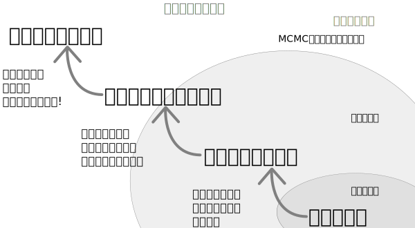

```{r echo=FALSE}
### Setting the global code chunk options ###
# Args
#   comment="": won't append any string to the start of each line of results
#   fig.align='center': align figures to the center of document
knitr::opts_chunk$set(comment = "", fig.align='center')
```

# GLMでは説明できないカウントデータ

- 現実のデータのばらつきは, ポアソン分布や二項分布だけではうまく説明できない
    - データにばらつきをもたらす「原因不明な(人間が測定できない・測定しなかった)個体差」がある
    - => **GLMM**
- **一般化線形混合モデル(generalized linear mixed model, GLMM)**: 「測定できない・しなかった個体差」を組み込んだGLM
    - **複数の確率分布を部品とする統計モデル**
        - e.g.) データのばらつきは二項分布、個体のばらつきは正規分布で表す



***

Example data

- 生存種子数が葉数とともにどのように増大するかを調べる
    - $y_{i} \leq 8$: $i$ の生存種子数
    - $2 \leq x_{i} \leq 6$: $i$ の葉数
    - $x_{i}$ の値ごとに20個体ずつサンプル, 全部で100個体をサンプル

```{r rows.print=5, max.print=25}
# only the first 25 rows gonna be rendered (5 rows per page)
d <- read.csv('../data/data7.csv')
d
```

```{r}
summary(d)
```

以下の破線が真の生存確率.

```{r }
v.x <- 0:8
xx <- seq(1, 7, 0.1)
 
logistic <- function(z) 1 / (1 + exp(-z))
 
plot.d <- function(
                   d, w = 0.1, col = "#199a60",
                   xlab = "x", ylab = "y",
                   axes = TRUE,
                   ylim = range(d$y),
                   ...) {
    plot(
        d$x, d$y,
        type = "n", # no plot
        xlab = xlab, ylab = ylab,
        axes = axes,
        ylim = ylim
    )
    for (x in sort(unique(d$x))) {
        dsub <- d[d$x == x, ]
        for (ns in sort(unique(dsub$y))) {
            n <- sum(dsub$y == ns)
            sx <- 1:n
            sdx <- ifelse(n == 1, 1, sd(sx))
            points(
                x + (sx - mean(sx)) / sdx * w,
                rep(ns, n),
                col = col,
                ...
            )
        }
    }
}
  
par.glmm <- function() par(mar = c(1.5, 1.5, 0.1, 0.1), mgp = c(1.5, 0.5, 0), cex = 1.0)
col.true = "#398ac2"
line.true <- function(col = col.true) lines(xx, logistic(-4 + 1 * xx) * max(v.x), lwd = 2, lty = 4, col = col)
 
par.glmm()
plot.d(d)
line.true()
```

***

まず, ロジットリンク関数を用いたGLMでモデリングを行うと以下のような結果になる.

$$
    {\rm logit}(q_{i}) = \beta_{1} + \beta_{2} x_{i} \\
    p(y_{i} | \beta_{1}, \beta_{2}, x_{i}) = \Biggl( \begin{matrix}8 \\ y\end{matrix} \Biggr) q_{i}^{y_{i}} (1 - q_{i})^{8 - y_{i}} \\
    {\rm log} L = \sum_{i} {\rm log} p(y_{i} | \beta_{1}, \beta_{2})
$$

```{r}
fit.glm <- glm(cbind(y, N - y) ~ x, family = binomial, data = d)
beta.glm <- fit.glm$coefficients
```

- 切片 ${\hat \beta_{1}}$ : `r beta.glm[1]`
- 傾き ${{\hat \beta_{2}}}$ : `r beta.glm[2]`

推定結果に基づく図示が以下.

```{r, }
col.glm <- "#de4545"
 
par.glmm()
plot.d(d)
line.true()
lines(xx, logistic(beta.glm[1] + beta.glm[2] * xx) * max(v.x), lwd = 3, col = col.glm)
```

真の傾き $\beta_{2} = 1$ に対して, かなり小さな値が推定されてしまっている.


# 過分散と個体差

- $x_{i} = 4$ だった場合の生存種子数と, 推定されたモデルの予測を比較する.
    - 予測生存確率 $q_{i}$ : logistic(`r beta.glm[1]` + `r beta.glm[2]` * 4) = `r logistic(beta.glm[1] + beta.glm[2] * 4)`

```{r, }
par.glmm()
d4 <- d[d$x == 4,]
prob <- logistic(beta.glm[1] + beta.glm[2] * 4)
plot(
	v.x, dbinom(v.x, 8, prob = prob) * nrow(d4),
	type = "b",
	ylim = c(0, 6),
	pch = 20, col = col.glm,
	xlab = "x", ylab = "y"
)
points(v.x, summary(factor(d4$y, levels = v.x)), pch = 1, col = "#199a60")
```

- データは明らかに二項分布に従っていない
    - => **過分散(過大分散, overdispersion)**: 二項分布で期待されるよりも大きなばらつきが生じている
        - c.f.) **過小分散(underdispersion)**: 期待される分散よりも標本分散がかなり小さくなること


## 過分散

$x_{i} = 4$ の個体の, 平均および分散は以下のようになる.

```{r}
c(mean(d4$y), var(d4$y))
```

- 生存確率の平均が $4.05 / 8 = 0.5$ ぐらいなら, もし生存種子数 $y_{i}$ が二項分布に従うならば, その分散は, $8 \times 0.5 \times (1 - 0.5) = 2$ ぐらいになるはず
    - [c.f.](https://mathtrain.jp/bin) ) 二項分布 $X \sim B(n, p)$ としたとき
        - 期待値 $E(X) = np$
        - 分散 $V(X) = np(1 - p)$
- しかし, 実際の分散は `r var(d4$y)` であり, 4倍ほど大きい: 二項分布における過分散の例
    - c.f. ) ポアソン分布も過分散が生じる
        - ポアソン分布: 平均と分散が等しい確率分布
        - but ) 実際のカウントデータでは, 平均よりも分散のほうが大きくなる場合がほとんど


## 観測されていない個体差

- 極端な個体差があるとして, 全個体の半数の生存種子数が8, 残りの半数が0とした場合, 過分散はよりひどくなる
    - 平均: $(8 \times 4 + 0 \times 4) / 8 = 4$
    - 分散: $8 \times 4^2 / 8 = 16$
    - 二項分布から期待される分散: $Nq(1 - q) = 8 \times 0.5 \times 0.5 = 2$
- -> *個体差があれば過分散が生じうる*
    - 「個体たちはみんな均質」といった過度に単純化した仮定を設けて, 「全個体の生存種子数の分布は, ただひとつの二項分布で説明できる」としてしまった

<br>

- 観測者が観測対象に影響を与えている要因すべてを定量・特定することはどうやっても不可能
    - => 個体差や場所差を原因不明ののまま, これらの及ぼす影響を統計モデルにうまく取り込む必要がある: 一般化線形混合モデル, GLMM


# 一般化線形混合モデル

## 個体差を表すパラメータの追加

個体差を表すパラメータ $r_{i}$ を $q_{i}$ に追加.

$$
    {\rm logit} (q_{i}) = \beta_{1} + \beta_{2} x_{i} + r_{i}
$$

- $q_{i} \in (- \infty, \infty)$ : 連続値
    - GLMは $q_{i} = 0$ としていることに相当する

```{r}
cols <- c("#118ab6", "#212198", "#af13a4")
plot(xx, logistic(-4 + 1 * xx + 0) * max(v.x), type = "l", xlab = "x", ylab = "y", col = cols[1], lwd = 3)
lines(xx, logistic(-4 + 1 * xx + 2) * max(v.x), col = cols[2], lwd = 3)
lines(xx, logistic(-4 + 1 * xx + -2) * max(v.x), col = cols[3], lwd = 3)
legend("topleft", legend = c(0, 2, -2), col = cols, lwd = 2, title = "r")
```

## 個体差のばらつきを表す確率分布

- GLMM: 個体差をあらわすパラメータ ${r_{1}, r_{2}, ..., r_{100}}$ が何かの確率分布に従っていると仮定
    - データに基づいてその確率分布のパラメータを推定できると考える
- ここでは, $r_{i}$ が平均 $\mu = 0$ で, 標準偏差 $s$ の (相互に独立した) *正規分布* に従うと仮定する
    - **なぜ正規分布なのか??**
        - そもそも, $r_{i}$ は観測できない・しなかった量なので, どのような確率分布に従うかはわからない
        - 正規分布を使う理由: 単にこのような統計モデリングに便利だから
    - c.f. )
        - 異常値の多い集団を扱うときは, $r_{i}$ がもっと「すその重い」確率分布に従うと仮定する: $t$ 分布
        - 階層ベイズモデル: $r_{i}$ の分布にさまざまなばらつきの正規分布を混合したものを使う

$r_{i}$ の確率密度分布は以下のようになり, $s$ を変化させたとき分布のプロットは次のようになる.
$$
    p(r_{i} | s) = \frac{1}{\sqrt{2 \pi s^2}} \exp \biggl( - \frac{r_{i}^2}{2s^2} \biggr)
$$

```{r}
x <- seq(-7.5, 7.5, 0.05)
cols <- c("#118ab6", "#212198", "#af13a4")
plot(x, dnorm(x, 0, 1), type = "l", xlab = "x", ylab = "y", col = cols[1], lwd = 3)
lines(x, dnorm(x, 0, 1.5), col = cols[2], lwd = 3)
lines(x, dnorm(x, 0, 3), col = cols[3], lwd = 3)
legend("topleft", legend = c(1, 1.5, 3), col = cols, lwd = 2, title = "s")
```

- $p(r_{i} | s)$ は $r_{i}$ の「出現しやすさ」を表している
    - $r_{i}$ が0に近い: ありがち
    - $|r_{i}|$ が大きい: あまりない
- 標準偏差$s$ は「集団内の $r_{i}$ のばらつき」を表している
    - $s$ が大きい: 個体差の大きい集団(過分散がひどい)

## 固定効果とランダム効果: 線形予測子の構成要素

- GLMMは以下の効果を「混合(mix)」した混合(効果)モデル(mixed effects model)
    - **固定効果(fixed effects)** : $\beta_{1}, \beta_{2} x_{i}$
        - データのかなり広い範囲を説明する大域的なパラメータ
        - $r_{i}$ のばらつき $s$ は(最尤推定される)固定効果
    - **ランダム効果(random effects)** : $r_{i}$
        - データのごく一部だけ担当している局所的なパラメータ

## 一般化線形混合モデルの最尤推定

- **$r_{i}$ は最尤推定できない**
    - 100個体分の生存数データ $y_{i}$ を説明するために100個のパラメータ $\{{\hat {r_{i}}}\}$ を最尤推定する: フルモデルになってしまう
- => *個体ごとの尤度 $L_{i}$ の式の中で $r_{i}$ を積分してしまう*

$$
    L_{i} = \int_{-\infty}^{\infty} p(y_{i} | \beta_{1}, \beta_{2}, r_{i}) p(r_{i} | s) dr_{i}
$$

- 尤度の期待値 $E(L)$ を算出しているのに相当
    - 二項分布 $p(y_{i} | \beta_{1}, \beta_{2}, r_{i})$ と正規分布 $p(r_{i} | s)$ をかけて $r_{i}$ で積分する = **2種類の分布を混ぜ合わせている: 無限混合分布(infinite mixture distribution)**
    - c.f.) ポアソン分布と正規分布を混ぜることもできる
- => $r_{i}$ が消えた対数尤度 $\log L(\beta_{1}, \beta_{2}, s) = \log \prod_{i} L_{i}$ を最大にするような, パラメータ $\beta_{1}, \beta_{2}, s$ の最尤推定値を探す

### RでのGLMMの最尤推定

- `glmmML` packageを使用する
    - `cluster = id`: $r_{i}$ が「個体ごとに異なる独立なパラメータ」であることを指定
        - `d` 内の `id` 列に格納されている個体番号を使う

```{r}
library(glmmML)
fit.glmm <- glmmML(cbind(y, N - y) ~ x, data = d, family = binomial, cluster = id)
print(fit.glmm)
```

- `coef`: パラメータの最尤推定値 (`se(coef)` や `z` は近似標準誤差やWaldのz値など)
    - ${\hat \beta_{1}}$: -4(真の値) vs. `r fit.glmm$coefficients[1]`(推定値)
    - ${\hat \beta_{2}}$: 1(真の値) vs. `r fit.glmm$coefficients[2]`(推定値)
- `Scale parameter ...`: $r_{i}$ のばらつき $s$ の最尤推定値
    - ${\hat s}$: 3(真の値) vs. `r fit.glmm$sigma`
    - `Std. Error`: $s$ の推定値のばらつき(標準誤差)
- `Residual deviance ...`
    - `97 degrees`: 最尤推定をしたパラメータ数は $\beta_{1}, \beta_{2}, s$ の3つなので, 自由度は $100 - 3 = 97$ となる

GLMMから得られた予測結果を以下に図示する. $q_{i}$ の $x_{i}$ 依存性, 生存種子数 $y_{i}$ の分布が改善されている.


```{r fig.show="hold", out.width="50%", out.height="100%", fig.align="default"}
beta.glmm <- fit.glmm$coefficients
col.glmm <- "#0205f5"
 
par.glmm()
plot.d(d)
line.true(col = )
lines(xx, logistic(beta.glm[1] + beta.glm[2] * xx) * max(v.x), lwd = 2, lty = 3, col = col.glm)
lines(xx, logistic(beta.glmm[1] + beta.glmm[2] * xx) * max(v.x), lwd = 3, col = col.glmm)
legend("topleft", legend = c("True", "GLM", "GLMM"), lty = c(4, 3, 1), col = c(col.true, col.glm, col.glmm), title = "model")
 
f.gaussian.binom <- function(alpha, x, size, fixed, sd)
    dbinom(x, size, logistic(fixed + alpha)) * dnorm(alpha, 0, sd)
d.gaussian.binom <- function(v.x, size, fixed, sd) sapply(
        v.x, function(x) integrate(
                f = f.gaussian.binom,
                lower = -sd * 10,
                upper = sd * 10,
                # for f.gaussian.binom
                x = x,
                size = size,
                fixed = fixed,
                sd = sd
        )$value
    )

par.glmm()
plot(
	v.x,
	nrow(d4) * d.gaussian.binom(
		v.x, 8,
		fixed = beta.glmm[1] + beta.glmm[2] * 4,
		sd = fit.glmm$sigma
	),
	type = "b",
	ylim = c(0, 6),
	pch = 20, lwd = 2, col = col.glmm
)
points(v.x, table(factor(d4$y, levels = v.x)), pch = 1, col = "#199a60")
```


# どのようなときにGLMMが必要か

- GLMMを採用するかどうかの判断ポイント
    - 過分散の有無
    - **データのとり方から, 「個体差や場所差が識別できるかどうか」**
        - **反復** か **擬似反復** か

## 反復・擬似反復と統計モデルの関係

- **反復(replication)**: 個体差や場所差のばらつきを考慮しないデータのとり方
    - e.g.) 各個体で1つだけ種子の生死を調べる(個体差なし) / 1つの植木鉢に1つの個体だけ植える(場所差なし)
    - GLMで推定して問題ない
        - 個体差や場所差の効果を除去して, 統計モデルを簡単にできる
- **擬似反復(pseudo replication)**: 「それぞれの個体や場所から複数のデータをとる」
    - e.g.1) 別々の植木鉢に植えられた, それぞれの個体から採取した $N$ 個の種子の生死を調べた(個体差あり)
        - 個体差 $r_{i}$ を組み込んだGLMM: ${\rm logit}(q_{i}) = \beta_{1} + \beta_{2} + r_{i}$
    - e.g.2) 1つの植木鉢に複数の個体を植えて, それぞれの個体で1つだけ種子の生死を調べる(場所差あり)
        - 場所差 $r_{j}$ を組み込んだGLMM: ${\rm logit}(q_{i}) = \beta_{1} + \beta_{2} + r_{j}$
    - e.g.3) 1つの植木鉢に複数の個体を植えて, それぞれの個体から採取した $N$ 個の種子の生死を調べる(個体差, 場所差あり)
        - 個体差 $r_{i}$ と場所差 $r_{j}$ を組み込む: ${\rm logit}(q_{i}) = \beta_{1} + \beta_{2} + r_{i} + r_{j}$
            - GLMMと最尤推定では厳しい: 階層ベイズモデルとMCMC


### いろいろな分布のGLMM

- ポアソン分布 $\times$ 正規分布 のGLMM: `glmmML`
- ポアソン分布 $\times$ ガンマ分布 のGLMM: `MASS::glm.nb`
    - **負の二項分布(negative binomial distribution)**: ポアソン分布とガンマ分布の無限混合分布
        - ポアソン分布: $p(y | \lambda)$
        - $\lambda \sim$ ガンマ分布
- 応答変数のばらつきが正規分布, ガンマ分布であるときは, 過分散を定義することはできない
    - => サンプリングが擬似反復ならば, GLMMのような個体差・場所差を考慮したモデルが必要
    - 正規分布やガンマ分布のGLMM: `lme4::glmer`
